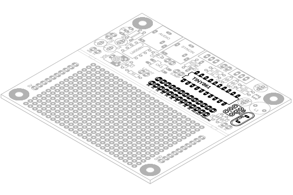
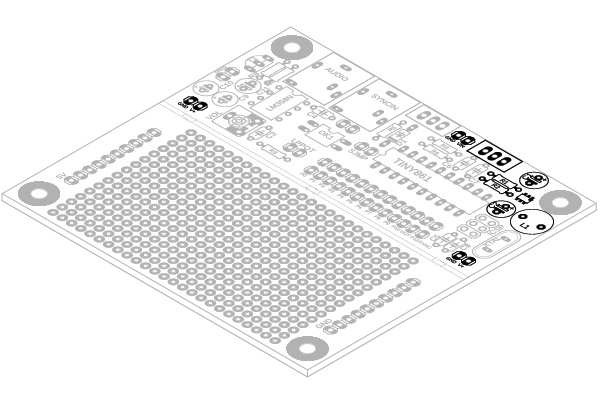
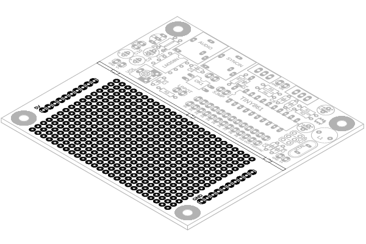
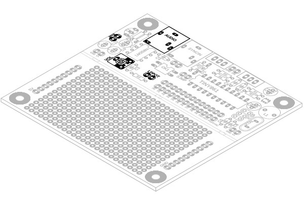
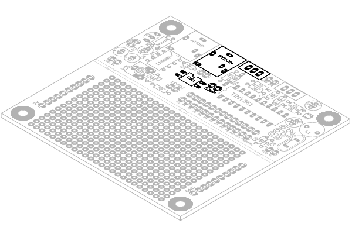
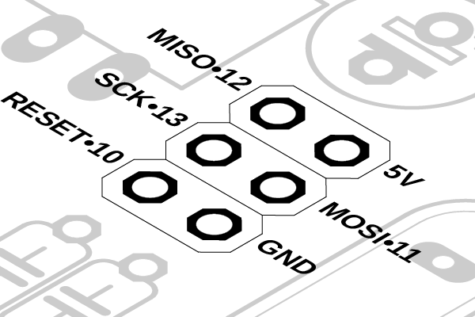

# fizzi

## Board
Das fizzi board lässt sich in 5 Baugruppen unterteilen:

**1. Microcontroller**  
Der Microcontroller, ein Attiny 861 ist das Herzstück des fizzi Boards.
Alle Anschlüsse können über die Pinleiste unterhalb des Microcontrollers erreicht werden. Über den ICSP-Anschluss kann der Attiny programmiert werden.  
  
  

Die folgende Tabelle zeigt die genaue Pinbelegung an der Anschlussleiste. Es empfiehlt sich beim Programmieren die Bezeichnungen aus der ersten Spalte zu verwenden, die anderen Spalten dienen nur der Übersicht. Wenn ein Pin als analoger Eingang verwendet werden soll, muss muss die Bezeichnung mit dem **A** verwendet werden. Also zum Beispiel **A_P0** anstelle von **P0**.
Da die Pins **P9** und **P10** auch gleichzeitig mit dem ICSP-Anschluss verbunden sind, muss man hier etwas acht geben. Wenn diese Pins zum Beispiel mit einem externen pullup oder pulldown Widerstand verbunden sind, kann es sein dass sich das Board nicht mehr programmieren lässt.

   
| PIN (fizzi) | PIN (Arduino) | PIN (physical) | info |
|------------|---------------|----------------|---------|
|P0 / A_P0   | 0 / A0		   | 20		      | analog  |
|P1 / A_P1   | 1 / A1		   | 19		      | analog  |
|P2 / A_P2   | 2 / A2		   | 18		      | analog  |
|P3 / A_P3   | 10 / A3		   | 14		      | analog  |
|P4 / A_P4   | 11 / A4		   | 13		      | analog  |
|P5 / A_P5   | 12 / A5		   | 12		      | analog  |
|P6 / A_P6   | 13 / A6		   | 11		      | analog  |
|P7 / A_P7   | 3 / A9		   | 9			      | analog  |
|P8          | 14    		   | 17		      |         |
|P9          | 9    		   | 1			      | ICSP    |
|P10         | 7    		   | 3			      | ICSP    |
|POUT        | 8    		   | 2		  	      |audio out|
|P12 / SYNC  | 6    		   | 4			      |sync in  |

**2. Stromversorgung**  
Der Schaltkreis auf dem fizzi Board wird mit einer Spannung von 5 Volt betrieben. Damit auch Batterien oder Akkus verwendet werden können, verfügt das Board über einen stepup Converter. Dadurch lässt sich es sich mit einer Spannung von 2,5 bis 4,5 Volt betreiben. Am oberen Rand befindet sich der Spannungseingang, direkt rechts daneben Anschlüsse für einen Ein-/Ausschalter.
Des Weiteren gibt es zwei Anschlüsse, an denen jeweils 5V und Ground zur verfügung stehen.  
  

	
**3. Protoarea**  
Die Protoarea ist ein Lochrasterfeld im standrard Rastermaß (2,54mm) mit einer Größe von 16x25 Lötpunkten. Darauf können Bauteile platziert werden, die für 
die Integration verschiedener Interface-Elemente benötigt werden. An den Seiten der Protoarea befinden sich Powerrails zur einfachen Verteilung von +5 Volt und Ground. Diese Powerrails müssen mit den Stromanschlüssen auf dem Hauptteil der Platine verbunden werden. Falls die Protoarea nicht benötigt wird, kann sie einfach abgebrochen werden.  
  
   


**4. Audio Output**  
Der 3,5mm Klinke Audioausgang befindet sich in der linken oberen Ecke des Boards. Außerdem ist links an der Seite noch ein Anschluss für einen 1 bis 2 Watt Lautsprecher. Um die Lautstärke zu regulieren kann an der vorgesehen stelle ein kleiner Trimmer eingesetzt werden. Das ist praktisch wenn man das fizzi Board nur zum prototypen verwendet, ansonsten empfielt es sich ein mit kabeln verbundenes Poti zu verwenden um sich später den Einbau in ein Gehäuse zu erleichtern. Die mit "LPPOT" beschrifteten Pins können einfach mit einem Jumper verbunden werden,oder man verbindet die beiden Pins mit dem Schleifer und einem der äußeren Kontakte eines 10k Potentiometers. So erhält man einen regulierbaren Lowpass Filter.  
  


lautsprecher widerstand

**5. Sync Input**    
Der Eingang für ein Taktsignal befindet sich direkt neben dem Audioausgang.
Um die Elektronik auf dem Board zu schützen ist der Eingang durch einen Optokoppler von der restlichen Schaltung getrennt. Direkt neben dem Eingang befinden sich Anschlüsse für eine Kipp- oder Schiebeschalter. Mittels diesem Schalter kann der sync mode aktiviert oder deaktiviert werden. Das Umschalten wird allerdings nur registriert, wenn es vor dem Einschalten des Boards passiert. Ein Umschalten während das Board eingeschaltet ist hat keinen effekt. Die Verbindung zwischen dem Microcontroller und dem Eingang lässt sich am "SJMP" jumper auftrennen. So kann der Pin am Microcontroller für andere zwecke verwendet werden wenn der sync mode nicht benötigt wird.



## Programmierung
### Vorbereitung und Wissenswertes
Das fizzi Board kann mit der Arduino IDE programmiert werden. Damit das klappt muss zuerst der ATtiny Core von Spence Konde installiert werden. Gehe dazu in der Arduino IDE auf **Datei -> Einstellungen** und füge diese URL __http://drazzy.com/package_drazzy.com_index.json__ zu den "Zusätzlichen-Boardverwalter-URLs" hinzu. Nun kannst du unter **Werkzeuge->Board->Boardverwalter** den Core finden und installieren.
Zum Programmieren des Boards benötigt man einen ISP-Programmer, man kann dafür aber auch einfach einen Arduino Uno als Programmer verwenden. Übertrage dafür den **ArduinoISP** Sketch der unter **Datei->Beispiele->11.ArduinoISP** zu finden ist auf den Uno. Anschließende muss noch ein 10µF Kondensator zwischen **RESET** und **GND** platziert werden, so dass der negative Pol des Kondensators mit **GND** verbunedn ist. Das folgende Diagramm zeigt, wie der Arduino mit dem ICSP-Anschluss auf dem fizzi Board verbunden werden muss.  


  
Stelle nun unter **Werkzeuge** folgendes ein: 
  
- Board: ATtin 261/461/861
- Clock: 16Mhz(external)  
- Chip: ATtiny 861  
- B.O.D. Level: disabled  
- Save EEPROM: EEPROM retained  
- Timer 1 Clock: 64 Mhz  
- LTO: disabled  
- Programmer: Arduino **as** ISP  
  
Als nächstes muss der Bootloader auf den ATtiny gebrannt werden indem man **Werkzeuge-> Bootloader brennen** auswählt. Nun muss noch die fizzi library heruntergeladen werden -> __https://github.com/Duffsman/fizzilibrary__ . Entpacke die .zip-Datei und kopiere den Ordner "fizzi" in den libraries Ordner von Arduino und starte die Arduino IDE neu.
Wenn das erledigt ist kann man den fizzi_start Sketch der unter **Datei->Beispiele->fizzi** zu finden ist auf das Board übertragen. Jetzt sollte bereits der erste Ton zu hören sein.
Doch bevor wir mit der Programmierung beginnen erstmal noch ein paar grundlegende Dinge:  

- Benutze kein `delay()`! Das führt dazu, dass das ganze Programm angehalten wird und somit auch kein Ton mehr erzeugt wird. 
- `millis()` geht auch nicht mehr, es gibt aber `fizziMillis()` als Ersatz. Außerdem gibt es **fizziMetro** und **fizziTimer** für timing zwecke.
- Benutze keine *float* Zahlen, die braucht keiner und außerdem brauchen die viel länger in der Verarbeitung. Also auch kein `map()` benutzen, das basiert nämlich auf *floats*.
- Versuche immer die kleinsten Datentypen zu verwenden, also wenn z.B. die Variable ohnehin nur von 0 bis 16 geht reicht es diese als *byte* zu deklarieren. So wird knapper Speicherplatz gespart.

Wenn man sich die Formel aus dem **fizzi_start** Beispiel anschaut, dann sieht man allerhand komische Zeichen wie `<<, >>, ^` oder `|` und `&`, doch was bedueten die eigentlich? 
Das alles sind so genannte binäre Operatoren, die folgende Liste zeigen was genau die machen.  

|	Term	       |	Ergebnis	| Beschreibung |
|---------------|-------------|--------------|
| `1010<<1`	   | `0100`			| shift nach links, alle Bits werden um eine Stelle nach links verschoben, von rechts kommt eine 0 rein 
| `1010>>1`		| `0101`			| shift nach rechts, alle Bits werden um eine Stelle nach rechts verschoben, von links kommt eine 0 rein   
| `~1010`			| `0101`			| NOT, alle Bits werden invertiert
| `1010&0011`		| `0010`			| AND, zwei Werte werden miteinander verrechnet, nur wenn in beiden Werten an der selben Stelle eine 1 steht wird diese ins Ergebnis übernommen 
|```1010|0011```		| `1011`		| OR, zwei Werte werden miteinander verrechnet, sobald einer der Werte an einer Stelle eine 1 hat, wird diese in das Ergebnis übernommen 
| `1010^0011`	 |	`1001`			| XOR, zwei Werte werden miteinander verrechnet, nur wenn sich in  beiden Werten die selbe Stelle unterscheidet wird eine 1 in das Ergebnis übernommen 
  
Beim gestalten der eingen Formel muss man das nicht wirklich verstehen, es kann aber hifreich sein. Das tolle an den binären Operatoren ist, dass man mit ihnen auch "normal" mathematische Vorgänge ausführen kann, nur geht das viel flinker. Hier die wichtigsten Beispiele:  

| Beispiel      |Equivalent| Beschreibung |
|---------------|----------|--------------|
| `x<<n`        | `x*2^n`  | *n* shifts nach links ist wie eine **Multiplikation** mit *2^n*
| `x>>n`	      | `x/2^n`  | *n* shifts nach rechts ist wie eine **Division** durch *2^n*
| `x&(n-1)`     |  `x%n`	  | wenn *n* eine Zweierpotenz ist ( also z.B. 2^4, 2^5, 2^6, usw.)kann anstellen von **Modulo** auch `&(n-1)` verwendet werden. 

ein Hinweis noch zur Verwendung von `analogRead()`: von Haus aus liefert der ADC eine 10-Bit Wert, also von 0 bis 1023. So eine große Auflösung wird m.E. aber garnicht benötigt, es reicht meistens eine Auflösung von 4 bis 8 bit. Mit dem right shift lässt sich das ganz einfach bewerkstelligen, denn mit jedem shift nach rechts veringert sich die Auflösung um 1 Bit. 
```
byte val = analogRead(PIN) >> 2; 
```
Die Variable val ist ein *Byte* und somit nur 8 Bit groß, mit dem zweifachen shift nach rechts wird die Auflösung des gemessene Wertes auf 8 bit reduziert. Fantastisch! 

### die Struktur von einem fizzi Sketch
Zur Programmierung des fizzi Boards gibt es eine Library. Der folgende Code zeigt die minimalste Struktur für einen fizzi Sketch:


```c
#include<fizzi.h> // library in den Sketch einbinden 

unsigned long t = 0; // die Zählervariable t

void setup() {
  initFizzi(); // initialisierung von Fizzi
  // alle weiteren dinge die ins setup gehören
  }

void updateControl(){
  // hier kommt alles hin, was zur versorgung der Interface elemente benötigt wird
  // also das, was man normalerweise in loop() schreibt
}

// und hier passiert die Magie
byte magicFormula(){
  // t wird hochgezählt
  t++;
  // sample berechenen
  int out =(t>>2)|(t<<3)&123;
  // sample bereitstellen 
  return byte(out);
}

// das sample aus der magicFormula wird vom defautOut verwendet
byte defaultOut() {
  return magicFormula();
}


// im loop sollte nur updateFizzi() passieren, sonst nix
void loop() {
  updateFizzi();
}
```
  
Zusammengefasst: Als erstes muss mit `#include<fizzi.h>`die Library in den Sketch eingebunden werden. 
Da die Berechnung der einzelnen Samples auf einem Zähler beruht wird als dieser als nächstes deklariert. Im `setup()`muss einmal `initFizzi()`aufgerufen werden um fizzi zu starten. Die Funktion `updateControl()` ersetzt quasi den `loop()`, hier kommt der ganze Code hin der fürs Interface benötigt wird. In der Funktion `magicFormula()`wird der Zähler inkrementiert und außerdem das nächste Sample auf Grundlage der Formel berechnet. Hier in diesem simplen Beispiel wird das Sample berechnete und einfach von `defaultOut()` übernommen. Diese Verränkung hat einen Grund, welchen sehen wir gleich noch. Schließlich wird im `loop()` die Funktion `updateFizzi()`, und auch nur diese Aufgerufen. Wenn das nicht passiert, passiert auch nix, kein Ton keine Controls, nix.  
Wenn wir den Sketch von oben auf das Board spielen, produziert es nur einen immer fortlaufenden Ton.
Das folgende Beispiel zeigt wie wir diesen Ton mit einem Potentiometer verändern können:

```c
#define FAST_ADC // aktiviert schnelleren Analog/Digital Converter
#include<fizzi.h> // library in den Sketch einbinden 

unsigned long t = 0; // die Zählervariable t
#define POT_PIN A_P0 // pin für Potentiometer, beachte die verwendung des 'A'
byte potVal = 0;
void setup() {
  initFizzi(); // initialisierung von Fizzi
  pinMode(POT_PIN,INPUT);  
  }

void updateControl(){
	potVal = analogRead(POT_PIN) >>2; // analog pin auslesen und auf 8 Bit skalieren
	potVal = potVal>> 4; // wert weiter runter skalieren auf 4 Bit (0...15)
}

// und hier passiert die Magie
byte magicFormula(){
  // t wird hochgezählt
  t++;
  // sample berechenen
  int out =(t>>2)|(t<<3)+(t*potVal);
  // sample bereitstellen 
  return byte(out);
}

// das sample aus der magicFormula wird vom defaultOut verwendet
byte defaultOut() {
  return magicFormula();
}


// im loop sollte nur updateFizzi() passieren, sonst nix
void loop() {
  updateFizzi();
}

```

In `updateControl()` wird der Wert vom Potentiometer ausgelsen und skaliert, die Formel wurde um einen Term erweitert, so dass *potVal* das Ergebnis beeinflusst. Der Aufmerksame betrachter hat bestimmt auch gesehen, dass sich ganz am Anfang des Sketch noch was geändert hat. Der Befehl `#define FAST_ADC`aktiviert einen anderen modus für den Analog/Digital Converter. Dadurch wird die Messung viel schneller durchgeführt, allerdings weniger präzise. Da wir die Auflösung aber ohnehin stark reduzieren spielt der Präzisionsverlust keine Rolle.  
Das letzte Beispiel zeigt nun wie eine fizzi Sketch aussehen muss wenn auch der sync mode verwendet werden soll:

```c
#define USE_SYNC // aktivieren des SYNC, das heißt der Schalter für den sync mode wird abgefragt 
					//und falls ein Taktsignal am EIngang anliegt wird dieses verarbeitet
#include<fizzi.h> // library in den sketch einbinden
#include<envelope.h> // envelope in den sketch einbinden

unsigned long t = 0; // Zählervariable 

Envelope env = Envelope(); // envelope Objekt erzeugen

void setup() {
  initFizzi();	// fizzi starten
 env.setADSR(500,500,500,500); // envelope einstellen
 env.sustainLevel(200);

}

void updateControl(){
  // hier kommt alles hin, was zur versorgung der Interface elemente benötigt wird
  // also das, was man normalerweise in loop() schreibt
  if(isSynced){
  	// hier kommt alles hin, was im syncMode besonders ist
  };

}

byte magicFormula() { // formel wird wieder ganz normal berechnet
  t++;
  int out =((t|(t>>(t%16)))>>4)& (t<<2);
  return byte(out);
}
// wenn der sync mode inaktiv ist wird der Ton auf der Grundalge des returns von defaultOut() erzeugt

byte defaultOut() { 
  return magicFormula();
}

// ist der sync mode aktiv, wird der Ton auf der Grundlage des returns von syncedOut() erzeugt
byte syncedOut() {
  return env.next(magicFormula());
}

// diese Funktion wird bei jedem neuen Synchronpuls ausgeführt
void syncPulse() {
env.noteOn();
}


void loop() {
  updateFizzi();

}

```

Als erstes muss der Library mitgeteilt werden, dass auch der sync eingang verwendet werden soll indem man ganz am Anfang den Befehl `#define USE_SYNC`platziert. Außerdem kommen noch zwei Funktionen dazu die gefüllt werden müssen: `syncedOut()` und `syncPulse()`. Je nachdem ob am Board der sync mode aktiviert ist, werden die samples in `defaultOut()`oder in `syncedOut()`berechnet. So kann man für die beiden Betriebsmodi unterschieldiche Verhalten implementieren. Die Funktion `syncPulse()` wird automatisch bei jedem neuen Synchronpuls ausgeführt. Hier kommt also alles rein was passieren soll wenn es einen neuen Impuls gegeben hat. eeeeeeeassssy! 


